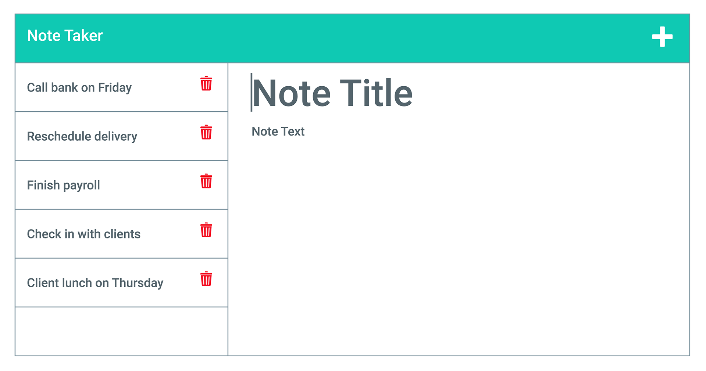

# Note Taker Application
    
    
## Description
    This application will allow the user to write notes and store them in the back-end server.
    

    
## Table of Contents
1. [Installation](#Installation)
2. [Usage](#Usage)
3. [License](#License)

    
    
    
## Installation
    In the terminal use command "node server.js" which show a link to the HTML app.
    

    
## Usage
    Once you have clicked on "Get Started" in the index.html it will then take you to the notes page. By writing a title and a note under it then clicking the save button, this will save the note and will be persistant so it will stay there when the page reloads.
    

    
## Licence  
MIT 
    

    
## Screen Grabs

    